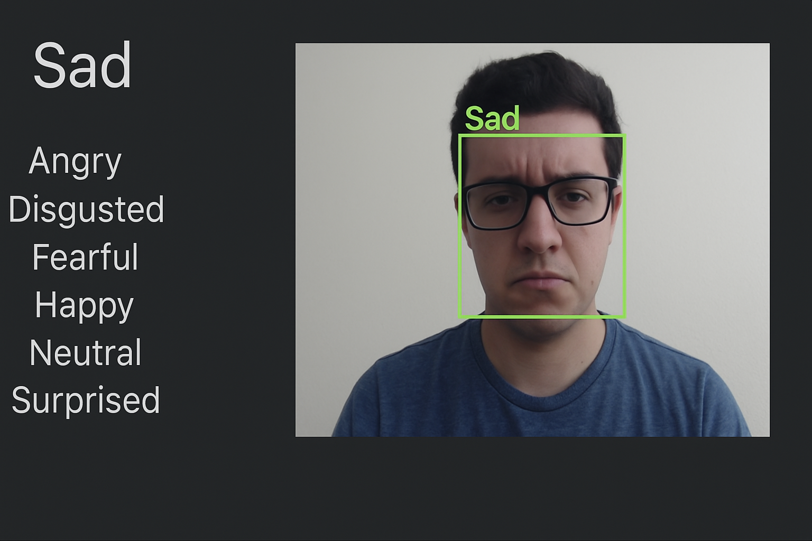

# Human Emotion Recognition Project

A real-time facial emotion recognition system built using Python, OpenCV, and TensorFlow. It classifies emotions from webcam input using a custom-trained CNN model and displays results live on screen.

## 🔍 Features
- Real-time emotion detection using webcam feed
- Improved accuracy by 15% through CNN optimization
- Modular pipeline for preprocessing, inference, and UI display

## 🧠 Tech Stack
- **Languages**: Python  
- **Libraries**: OpenCV, TensorFlow, Keras, NumPy, scikit-learn  
- **Tools**: Jupyter Notebook, matplotlib

## 🎥 Demo


## 🚀 Getting Started

1. Clone this repository:
   ```bash
   git clone https://github.com/Anuja13009/Human-Emotion-Recognition-Project.git


   
